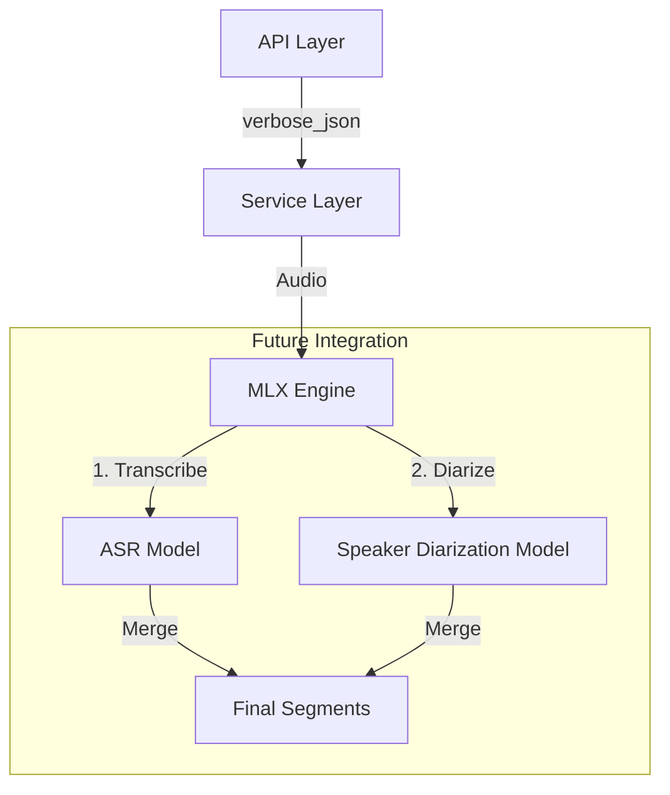

## 1. 目标 (Goal)
在现有的 ASR 转录服务基础上，增加**说话人分离 (Speaker Diarization)** 能力，即“谁在什么时候说了什么”。

## 2. 当前状态 (Current Status)

### 2.1 API 层支持
✅ **API 已就绪**
- 接口已支持 `response_format=verbose_json` 参数。
- 返回的 JSON 结构中包含 `segments` 数组。
- 数据模型 `Segment` 已包含 `speaker` 字段 (nullable)。

### 2.2 模型层现状
⚠️ **当前模型限制**
- 默认使用的 **Qwen3-ASR-1.7B-4bit** 虽然转录精度高、速度快，但**不原生支持**说话人分离。
- `speaker` 字段目前始终返回 `null`。

| 模型 | 说话人分离 | 长音频支持 | 处理速度 | 推荐 |
|-----|----------|-----------|---------|-----|
| **Qwen3-ASR-1.7B-4bit** | ❌ | ✅ (>17min) | ⚡ 快 | ✅ 默认 |
| **Whisper-Large-v3** | ❌ | ✅ | 🐢 较慢 | 备选 |
| **Pyannote** | ✅ | ✅ | - | 需集成 |

## 3. 架构设计 (Architecture)

### 3.1 接口预留
当前架构已为未来的 Diarization 模块预留了位置：



### 3.2 实施方案 (Implementation Options)

#### 方案 A: 等待端到端模型 (Passive)
- **描述**: 等待 MLX 社区发布支持 Diarization 的 E2E ASR 模型（如基于 Whisper 变体）。
- **优点**: 零开发成本，保持架构简单。
- **缺点**: 时间不可控，效果不确定。

#### 方案 B: 集成 Pyannote-Audio (Active)
- **描述**: 在 Service 层引入独立的 Diarization 管道。
- **工作流**:
    1.  Service 接收音频。
    2.  并行/串行运行 ASR (得到文字+时间戳) 和 Diarization (得到说话人+时间戳)。
    3.  通过时间戳对齐算法，将 `speaker` 标签注入 ASR 的 `segments`。
- **成本**:
    - 需引入 `pyannote.audio` 依赖 (基于 Torch)。
    - 额外显存占用 (~2GB)。
    - 推理延迟增加约 30%。

#### 方案 C: 基于 FunASR + Cam++ 的原生集成 (Chosen ✅)
- **描述**: 使用 FunASR 官方提供的 `cam++` 声纹模型直接在推理引擎内完成分离。
- **优点**: 极速、低显存、原生支持 MPS、实现简单。
- **规范文档**: [SPEC-007-Speaker-Diarization-FunASR.md](./SPEC-007-Speaker-Diarization-FunASR.md)
- **结论**: 该方案已取代方案 B 成为本项目说话人分离的标准实现路径。

## 4. API 契约 (API Contract)

### 请求
```bash
curl -X POST http://localhost:50070/v1/audio/transcriptions \
  -F "file=@meeting.mp3" \
  -F "response_format=verbose_json"
```

### 响应
```json
{
  "text": "...",
  "segments": [
    {
      "id": 0,
      "speaker": "SPEAKER_01", 
      "start": 0.0,
      "end": 3.5,
      "text": "大家好，现在开始开会。"
    },
    {
      "id": 1,
      "speaker": "SPEAKER_02",
      "start": 3.6,
      "end": 5.2,
      "text": "好的，收到。"
    }
  ]
}
```

## 5. 下一步计划 (Next Steps)
1.  **评估 Pyannote 在 M1 Max 上的性能**: 测试其在 MPS 后端的兼容性。
2.  **原型开发**: 编写脚本 `examples/demo_diarization.py` 验证对齐算法。
3.  **集成**: 决定是否将其作为可选插件 (`Feature Flag`) 引入主分支。